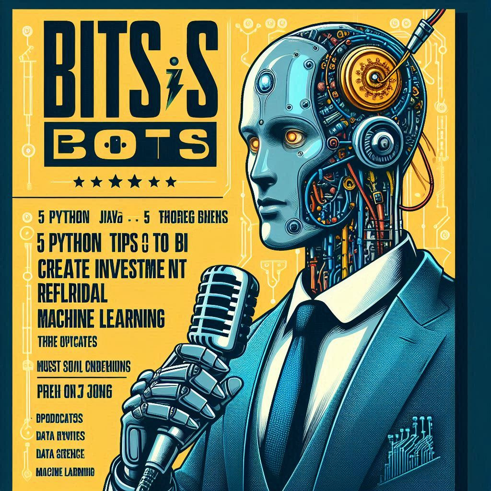

# Título: 5 dicas de Python para criar Machine Learning

## Projeto de **PodCast** gerado por I.A.s

 > ℹ️ **NOTE:** Este é o repositório desenvolvido durante o curso no qual fui aluno do BootCamp Santander 2024 Fundamentos de IA para DEV na plataforma da [DIO](https://dio.me).
>
>  **Conteúdo baseado**
>
> Natural ou Fake Natty? Como Vencer na Era das IAs Generativas
>
> Inspirado na hype _"Natty or Not"_ do fisiculturismo, este Lab da DIO te convida a conhecer o mundo das IAs Generativas, explorando o potencial dessas tendências tecnológicas incríveis!

### **Título do Poscast: "5 dicas de Python para criar Machine Learning"***

Capa 

    

<b>   

    preview do podcast

</b>

    <audio src="output/PodCast_Bit_Bots_Python_e_ML_Fnalizado.MP3" controls title="Podcast editado"></audio>

## 📒 Descrição
O projeto foi criado com o formato de podcast, sendo apresentado por uma voz criada e gerida por uma IA.
Este podcast fala sobre dicas de como usar a linguagem Python para criar Machine Learning com um foco na área de mercado de investimento e tendências
Buscamos integrar tecnologias diferentes para produzir um podcast que traga conteúdo e seja cativante.
Este projeto será entregue no bootcamp 2024 Santander Fundamentos de IA para DEV

## 💻 Tecnologias utilizadas no projeto

- [Bing Copilot Designer](https://copilot.microsoft.com) - Criação da capa do podcast.
- [Gemeni](https://gemini.google.com/app) - Criação de conteúdo do podcast.
- [ChatGPT](https://chat.openai.com/) - Refatoração do conteúdo do podcast.
- [ElevenLabs](https://beta.elevenlabs.io/) - Criação de audio, que faz a naração do podcast.
- [Capcut](https://www.capcut.com/pt-br/) - Edição e finalização do podcast.

## 📄 Prompts e ferramentas

### **ChatGPT, Gemini e Bing Copilat Designer：**

|   Ação   | prompt                                                                                                                                                                                                                                                                         |
| :------: | ------------------------------------------------------------------------------------------------------------------------------------------------------------------------------------------------------------------------------------------------------------------------------ |
|  **Imagem capa**  |Crie uma capa para o podcast de tecnologia "Bits & Bots". O podcast explora tópicos como Python, Java,   			inteligência artificial, ciência de dados e aprendizado de máquina. A capa deve ser do tema deste   			podcast que e sobre "5 dicas de Python para criar Machine Learning de indicação de investimentos"   			.A imagem deverá seguir as condições {REGRAS} abaixo.    			{REGRAS}  			As palavras seriam claras e significativas  			Misture a imagem de um robô tipo humanoide super realista e uma tela grande de monitor  			Coloque este robô em um cenario do fime Matrix e insira elementos do filme, de forma a tormar mais real a imagem  			O design deve transmitir claramente a ideia do podcast.  			Aparência adulta.  			Estilo futurista baseado no filme Matrix  			Alta resolução, ultra realista, 16K de definição, com cores super nitidas|
| **conteúdo** | Você é um roterista de podcast, vamos criar um roteiro de um podcast de tecnologia, focado em "5 dicas de Python para criar Machine Learning de indicação de investimentos"     o podcast é o "Bits & Bots - Decodificando a Tecnologia" e tem foco em IAS, com o      público alvo são devs iniciantes em IA e Machine Learning e pessoas que tem curiosidade sobre o assunto.     O formato do reoteiro deve ser      [INTRODUÇÃO]			     [DICA 1]     [DICA 2]     [DICA 3]     [DICA 4]     [DICA 5]     [FINALIZAÇÃO]     {REGRAS}     > no bloco [INTRODUÇÃO substitui por uma introdução igual as introduções do canal do YouTube "EiNerd!", como se fosse narrado e escrito pelo Peter Jordam     > no bloco [DICA 1] substitua pelas principais de biblioteca em Python para fazer analise de dados e Machine Learning, estas devem ser bem usadas no dev de aplicações do "mercado de investimento" atual.     > no bloco [DICA 2] fale sobre algumas biblitecas em Python para fazer apresentação de dados, quais são, aplicação e por fim vantangens e desvantagens     > no bloco [DICA 3] fale sobre os frameworks que são mais usados para Machine Learnig e Python os pontos fortes e fracos de cada um, sobre cada algoritmo que e usado em cada framework e ainda cite a aplicação de cada um com alguns exemplos     > no bloco [DICA 4] fale sobre a formação dos profissionais que querem trabalhar nesta área e quais as profissões existentes     > no bloco [DICA 5] fale sobre as pespectivas de futuros sobre a utilização de Python e Machine nas empresas. Como estão posicinadas ? Onde deveriam estar hoje? Onde querem chegar em 10 anos?     > no bloco [FINALIZAÇÃO] substitua por uma despedida cool com o final "Eu sou Álvaro e esse foi o Bits & Bots dessa semana"     > use termos de fácil explicação     > o podcast vai ser apresentado somente por uma pessoa, chamada Álvaro     > o podcast deve ser curto     {REGRAS NEGATIVAS}     > não use muitos termos técnicos, porém quando usar, explique de forma simples.     > não ultrapasse 10 minutos de duração	|

## 🧐 Processo de Criação
		
A jornada para criar o podcast sobre Python e Machine Learning, foi repleto de dicas focadas para quem quer entrar nesse universo incrível.

Primeiro, tive a ideia de falar sobre Python e Machine Learning, pensando em como essas ferramentas são essenciais para o futuro da tecnologia. Decidi que as dicas seriam bem práticas e com um foco bem definido para vocês aplicarem de imediato.

Aí, pensei: precisamos de uma capa impactante para o podcast, algo que chame a atenção logo de cara. Usei o Bing Copilot Designer para isso. Gente, foi incrível! Super intuitivo e o resultado ficou show de bola.

Com a ideia no papel (notepad ++) e a capa prontinha, parti para criar o conteúdo do podcast. Queria algo direto, mas que não fosse superficial. Então, criei um prompt para nos guiar na criação do roteiro.

Submeti esse prompt ao Gemini e ao ChatGPT, que se complementaram perfeitamente para gerar um conteúdo ainda mais rico e interessante. A partir daí, fiz uma revisão minuciosa do texto para garantir que tudo estava redondo.

Mas não para por aí! Para dar vida ao texto, procurei uma IA que pudesse narrar nosso podcast. Encontrei a ElevenLabs, que tem vozes incríveis. Ajustei o texto aqui e ali e escolhi a melhor voz para interpretar nosso conteúdo.

Finalmente, para dar aquele toque profissional, juntei a narração com uma trilha sonora de fundo. Usei o CapCut, onde escolhi uma entrada impactante e duas músicas de fundo que compuseram a finalização do nosso podcast.

E pronto! Depois de todo esse processo, finalizamos a criação do nosso podcast. Ufa! Foi uma jornada e tanto, mas o resultado valeu cada segundo.	

## 🚀 Resultados

A capa ficou show, feita com o Bing Copilot Designer. O conteúdo é super dinâmico, resultado da colaboração entre Gemini e ChatGPT, garantindo qualidade top. E pra fechar com chave de ouro, a narração foi feita com a incrível IA da ElevenLabs, com trilha sonora impactante escolhida no CapCut.

Foi uma jornada de descobertas acertos e ajustes, mas o resultado acredito que ficou sensacional!

## 💭 Reflexão

Criar algo "natty" com IA, ou seja, que pareça natural e autêntico, é um desafio fascinante e complexo. De um lado, temos os prós: a IA pode automatizar tarefas tediosas, oferecer insights poderosos e criar conteúdo de alta qualidade em pouco tempo. Ela permite uma personalização que seria impossível manualmente, e a colaboração entre diferentes IAs, como Gemini e ChatGPT, pode resultar em produtos extremamente refinados e inovadores.

Por outro lado, os contras incluem a dificuldade de capturar nuances humanas e emocionais, o que pode fazer com que o resultado final pareça artificial. Além disso, o uso intensivo de IA pode levantar questões éticas sobre a autenticidade do conteúdo e a substituição do trabalho humano. Equilibrar a eficiência da IA com a necessidade de manter um toque humano é essencial para criar algo que ressoe genuinamente com as pessoas. O verdadeiro desafio é integrar essas ferramentas de maneira que o produto final não só impressione pela tecnologia, mas também toque pela humanidade.

<h3>

DISCLAIMER 

</h3>

   Todo o projeto e o conteúdo deste README, foi criado com o suporte de IA, contudo tudo foi revisado por uma ser 100% humano.

